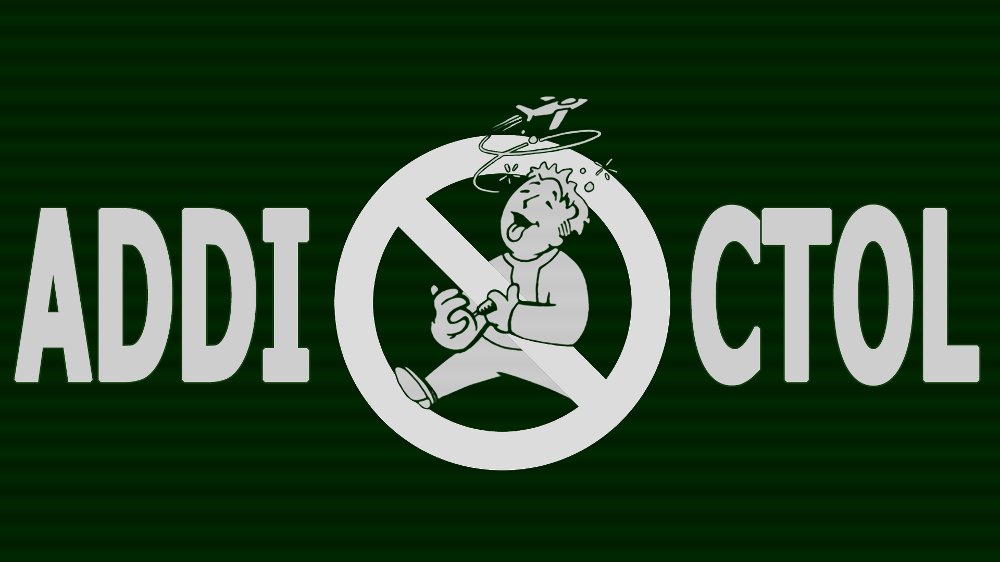

<div align="center">
  
</div>

# Addictol

An F4SE plugin that combines engine fixes, crash fixes, and performance patches for Fallout 4 into
a single DLL.

Consolidates patches from Buffout 4, X-Cell, Mentats, Escape Freeze Fix, Baka MaxPapyrusOps,
Interior NavCut Fix, and Faster Workshop, alongside fixes written for this project.

Crash logging is not included here. It ships separately as
[AddictolCrashLogger](https://github.com/Dear-Modding-FO4/AddictolCrashLogger).

## Supported runtimes

One DLL covers all three; there is no separate download per version.

| Runtime | Version |
| --- | --- |
| OG | 1.10.163 |
| NG | 1.10.984 |
| AE | 1.11.221 |

## Features

- **Memory Manager** - Replaces the game's allocator with a selectable backend
- **Faster Workshop** - O(1) keyword lookups instead of scanning all constructible objects
- **LibDeflate** - Faster BA2 decompression via libdeflate
- **Facegen** - Validates NPC face textures before using preprocessed data
- **Input Switch** - Proper keyboard/gamepad device switching
- **Scaleform Allocator** - Replaces Scaleform's memory mapper with configurable page/heap sizes
- **Archive Limits** - Increases max BA2 archives the game can load
- **Profiler** - Profiler for definitions performance your collection mods
- **Papyrus GC Bug** - Fixes a critical bug in garbage collection that causes premature loop termination
- ~80 modules in total, covering crash fixes, engine bug fixes and stability patches

## Requirements

- Fallout 4, on one of the runtimes above
- [F4SE](https://f4se.silverlock.org/)
- The **Address Library** for your runtime. Addictol will refuse to load without it.

## Installation

Install with a mod manager, or extract the release archive into your Fallout 4 `Data` directory so
that the files land as:

```
Data/F4SE/Plugins/Addictol.dll
Data/F4SE/Plugins/Addictol.toml
Data/F4SE/Plugins/Addictol_FacegenExceptions.ini
Data/F4SE/Plugins/Addictol_SNCT.ini
Data/Scripts/Addictol.pex
Data/Scripts/XCELL.pex
```

The archive also contains `Addictol.pdb` and the Papyrus script sources; neither is needed to play.

## Configuration

Nearly every module can be individually toggled; a small number are mandatory and always run.
`Addictol.toml` is the shipped configuration and documents each option inline.

**Do not edit `Addictol.toml` directly**, because it is overwritten on update. Instead create
`AddictolCustom.toml` next to it, containing only the sections and keys you want to change:

```toml
[Fixes]
bUnalignedLoad = false
```

Options are grouped into `[Patches]` (subsystem replacements), `[Fixes]` (bug and crash fixes),
`[Warnings]` (diagnostics for problems in your load order), `[Others]` (patches for specific
third-party mods), `[Additional]` (tunables belonging to another option) and `[Profiler]`
(diagnostics).

Addictol writes `Addictol.log` to `Documents\My Games\Fallout4\F4SE\`, listing which modules loaded
and any that disabled themselves. Check it first if something is not working.

## Building

Requires Visual Studio 2022 Build Tools (or VS 2022) with the v143 toolset.

```powershell
git clone --recurse-submodules https://github.com/Dear-Modding-FO4/Addictol.git
cd Addictol
MSBuild VC/Addictol.sln -p:Configuration=Release -p:Platform=x64
```

Output: `.Build/F4SE/Plugins/Addictol.dll`

## Contributing

See [CONTRIBUTING.md](CONTRIBUTING.md) for the development setup, the module model, the rules for
handling game addresses across the three runtimes, and what a pull request needs to include.

## License

GPL-3.0 with a Modding Exception. See [LICENSE](LICENSE) and [EXCEPTIONS](EXCEPTIONS).
